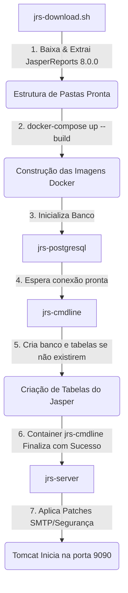

# JasperReports Server 8.0.0 Community Edition for Docker

[English version below]

---

## 🇧🇷 Versão em Português

Este projeto disponibiliza o **TIBCO JasperReports Server Community Edition (versão 8.0.0)** rodando em containers Docker junto com o banco de dados **PostgreSQL 12**.

---

### 🔄 Fluxo de Funcionamento Completo (Ciclo de Vida do Projeto)

Para entender o ciclo de vida completo do projeto, desde o download inicial até a execução do servidor, o projeto segue o seguinte fluxo estruturado:



#### Passo 1: Download e Preparação (`jrs-download.sh`)
* **O que faz:** O primeiro passo baixa a distribuição oficial binária do JasperReports Server Community Edition (`8.0.0`) e a descompacta na pasta de recursos locais (`resources/`). Isso fornece os arquivos necessários para o Tomcat e as ferramentas de banco de dados (`buildomatic`).

#### Passo 2: Construção das Imagens (`docker-compose build`)
Quando você roda a construção do ambiente, o Docker gera duas imagens personalizadas baseadas em Java:
* **`jasperserver-cmdline:8.0.0`**: Contém o utilitário `buildomatic` e scripts utilitários.
* **`jasperserver:8.0.0`**: Contém a instalação do Apache Tomcat 9 e os arquivos do JasperReports Server prontos para implantação.

#### Passo 3: Ordem de Execução e Dependências (`docker-compose up -d`)
Quando o comando é executado, os containers iniciam respeitando dependências estritas:
1. **Banco de Dados (`jrs-postgresql`):** Inicializa o PostgreSQL 12 na porta local `5434`.
2. **Inicializador do Banco (`jrs-cmdline`):**
   * Aguarda (via script `wait-for-it.sh`) até que o banco de dados PostgreSQL esteja aceitando conexões.
   * Conecta ao Postgres e checa se o banco `jasperserver` já existe.
   * **Se o banco não existir:** Executa as tarefas `create-js-db`, `init-js-db-ce` e `import-minimal-ce` para criar o banco de dados, criar o esquema de tabelas do JasperReports e carregar os dados mínimos de inicialização.
   * **Se o banco já existir:** Ele pula a criação para proteger seus dados de serem sobrescritos.
   * **Finalização:** Uma vez concluídas estas tarefas, o container encerra suas atividades com sucesso e passa para o estado de **`Exited (0)`**.
3. **Servidor Tomcat (`jrs-server`):**
   * Só inicia quando o container `jrs-cmdline` é encerrado com sucesso (`service_completed_successfully`).
   * Executa o script `entrypoint-ce.sh`.
   * Verifica se existem zips de customização ou licenças para aplicar.
   * Executa a rotina `deploy-webapp-ce` do buildomatic para copiar as configurações de fonte de dados e arquivos web para dentro do diretório `/usr/local/tomcat/webapps/jasperserver`.
   * Executa as rotinas de segurança e as de e-mail (SMTP) (ajustadas por nós para evitar falhas se as variáveis de ambiente estiverem ausentes).
   * Executa o servidor Tomcat (`catalina.sh run`) mantendo o servidor web de relatórios ativo na porta local **`9090`**.

---

### 🏗️ Arquitetura e Portas

* **`jrs-postgresql` (PostgreSQL 12):**
  * **Porta interna:** `5432` | **Porta exposta (Host):** `5434`.
  * **Credenciais padrão:** Usuário `postgres` e senha `postgres`.
* **`jrs-cmdline` (Banco Inicializador):**
  * Executa a preparação do banco de dados e finaliza automaticamente.
* **`jrs-server` (JasperReports Server / Tomcat 9):**
  * Executa o JasperReports Server ativo.
  * **Porta interna:** `8080` | **Porta exposta (Host):** `9090`.

---

### ⚙️ Configurações de Variáveis de Ambiente

As configurações principais ficam no arquivo [js-docker/jasperreports-server.env](file:///c:/Users/EUGENIO/Downloads/jasperreports/js-docker/jasperreports-server.env).

#### Configuração de E-mail (SMTP)
Crie o arquivo `smtp.env` se quiser habilitar notificações de e-mail nos agendamentos:
```bash
cp js-docker/smtp.env.example js-docker/smtp.env
```
*Se a variável `SMTP_HOST` não estiver definida em seu ambiente, o inicializador automaticamente ignorará a configuração customizada de SMTP, mantendo a porta de e-mail padrão do JasperReports ativa para evitar erros de inicialização.*

---

### 🚀 Comandos de Execução Básica

#### Inicializar e construir o projeto pela primeira vez
```bash
./jrs-download.sh
docker-compose up -d --build
```

#### Verificar logs em tempo real do servidor
```bash
docker-compose logs -f jrs-server
```

#### Parar os serviços (mantendo os dados do banco intactos)
```bash
docker-compose down
```

#### Limpeza total (Apagar banco de dados e recomeçar do zero)
```bash
docker-compose down -v
```

---

### 🔑 Credenciais de Acesso

* **Interface Web do JasperReports:**
  * **Link:** [http://localhost:9090/jasperserver](http://localhost:9090/jasperserver)
  * **Administrador:** Usuário `jasperadmin` / Senha `jasperadmin`
  * **Usuário comum:** Usuário `joeuser` / Senha `joeuser`

* **Conexão ao PostgreSQL (DBeaver, pgAdmin, etc.):**
  * **Host:** `localhost`
  * **Porta:** `5434`
  * **Usuário:** `postgres`
  * **Senha:** `postgres`
  * **Banco de dados:** `jasperserver`

---

## 🇺🇸 English Version

This project allows you to run **TIBCO JasperReports Server Community Edition (version 8.0.0)** running in Docker containers with a **PostgreSQL 12** database.

### 🔄 Project Operations & Lifecycle

The lifecycle follows this execution pipeline:
1. **Initial download (`jrs-download.sh`):** Fetches the official JasperReports zip file and extracts it to the `resources/` folder.
2. **Image Building (`docker-compose build`):** Creates Java-based Docker images for database setup (`jasperserver-cmdline`) and web hosting (`jasperserver`).
3. **Execution & Startup Sequence (`docker-compose up`):**
   * **`jrs-postgresql`** boots up.
   * **`jrs-cmdline`** waits for PostgreSQL, connects, creates the schema/database `jasperserver` if not present, and then **safely exits (status `Exited (0)`)**.
   * **`jrs-server`** waits for `jrs-cmdline` to finish successfully, builds the war structure, runs entrypoint configurations (including our custom SMTP and security patches), and boots Apache Tomcat on local port **`9090`**.

### 🔑 Credentials & Access

* **URL:** [http://localhost:9090/jasperserver](http://localhost:9090/jasperserver)
* **Admin Login:** User `jasperadmin` / Password `jasperadmin`
* **PostgreSQL Port:** `5434` (User: `postgres` / Pass: `postgres` / DB: `jasperserver`)
